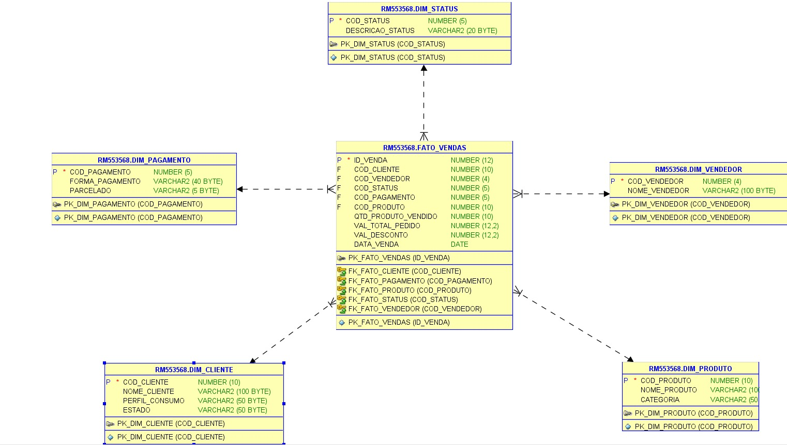

# CP4 - BANCO DE DADOS

## 📌 Checkpoint 4 - Banco de Dados

Este projeto faz parte do Checkpoint 4 da disciplina de Banco de Dados, cujo objetivo principal é desenvolver um modelo estrela com procedimentos para popular e consultar tabelas no banco Oracle.

## 🛠️ Funcionalidades

- [x] Criação das tabelas de dimensão e tabela fato (modelo estrela).
- [x] Procedures para inserção de dados com tratamento de exceções.
- [x] Validações para evitar duplicidade e garantir integridade.

## 📌 Modelo Estrela

O projeto utiliza o seguinte esquema dimensional:

- **FATO_VENDAS**
  - DIM_CLIENTE
  - DIM_VENDEDOR
  - DIM_PRODUTO
  - DIM_STATUS
  - DIM_PAGAMENTO
 
## 🧑‍💻 Contribuidores
LUIS HENRIQUE OLIVEIRA - RM552692

SABRINA CAFÉ - RM553568

MATHEUS DUARTE - RM554199

## 📌 DIAGRAMA

